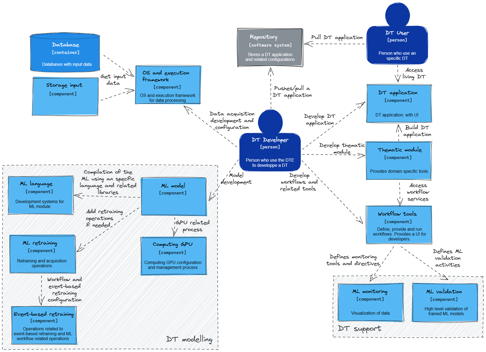

# Container diagram

The next diagram is derived from an analysis of the preliminary requirements interviews with various project partners. It provides a technology-agnostic system overview, revealing how server-side applications, databases, and client-side applications interconnect to deliver functionality.

[Context diagram (click to edit)](https://excalidraw.com/#json=h4Ezn5Mekaro127nWuKxp,mrWDAXveoO8KshJjn-nOkA)

Two primary user types interact with the *DTE*: the *DT* User and the *D*T Developer.

The *DT* Users interact with the Repository and *DT* Application. The Repository acts as a catalogue where the *DT* User can select  and access the required *DT* Applications. Once selected and instantiated, these applications are used directly by the *DT* User within the *DTE* system, providing the necessary interface to simulate and analyse the behaviour of physical counterparts in a virtual environment.

On the other hand, the *DT* Developer is responsible for creating and maintaining key system components. The Developer accesses the Repository to perform push/pull requests for their developments, thereby maintaining the application catalogue that the DT User interacts with. They are also the creators of the *DT* Application and can develop thematic libraries and modules within the Thematic Modules container. They configure workflows in the Workflow Tools container and can also create and configure the ML Model. Additionally, they may interact with the OS and Execution Framework for specific configuration tasks or to facilitate particular computational operations, reflecting their broader role within the system.

Key components of the *DTE*, like the Thematic Modules, Workflow Tools, and ML Model, interact seamlessly to ensure the *DT* Applications function smoothly. Thematic Modules supplement the *DT* Application with specialised functionalities, enabling it to serve a broad range of use cases. Meanwhile, Workflow Tools facilitate the management of various operational sequences within the *DTE*, assisting the Thematic Modules and interacting with the ML Model and DT Support for model monitoring and validation services.

The ML Model is a critical component that leverages computational resources from the Computing GPU container to execute machine learning operations. It is also connected to the ML Retraining container, which houses functionalities for model retraining, thus ensuring that the model stays up-to-date with the latest data and maintains high performance. This retraining can be event-based, a process facilitated by the Event-Based Retraining container. The ML Language container supplements the ML Model by providing the appropriate programming language for model development and execution.

The OS and Execution Framework acts as a bridge for data flow and system operations. It facilitates the *DT* Developer's interactions with various system components and enables data from the Databases and Storage Input containers to reach the other parts of the system.

This diagram represents the initial interpretation of the *DTE*'s architecture and will be updated as the project evolves and as more data and requirements are gathered from project partners. It serves as a fluid representation of the system's architecture, adaptable to changes in project needs and technological advances.

This iterative approach ensures that our *DTE* remains flexible and scalable, ready to meet the evolving project requirements and harness future technological advancements.
