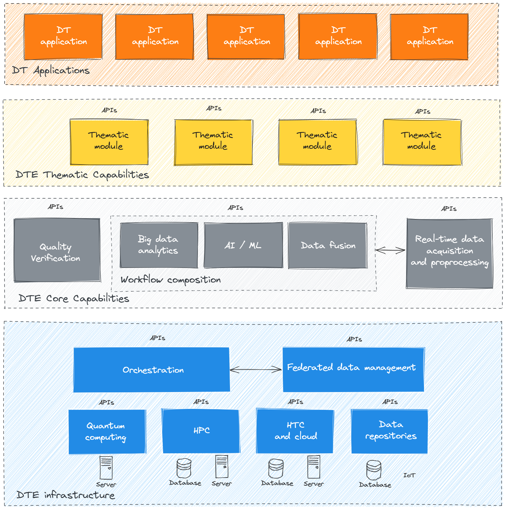

# The proposal

The *Digital Twin Engine* (*DTE*) is an open-source integrated platform based on open standards, APIs and protocols that offers the capability to integrate with application-specific *Digital Twins* (*DTs*). Its functional specifications and implementation are based on a co-designed interoperability framework and conceptual model of the *DT* for research - the *DTE blueprint architecture*. We assume the blueprint architecture is an instrument to introduce a level of abstraction that is sufficient to meet the requirements of the use cases for which different *DTs* are designed. As illustrated below, the *interTwin* *DTE* is organized in three functional areas: *Infrastructure*, *Core* and *Thematic capabilities*.

[General view (click to edit)](https://excalidraw.com/#json=qLZ70Zsvdgf4amWihE3aa,RXKW6o-H7JmiEUv8HVNZMg)

Based on open-source software components, the *DTE* is designed to adhere to the following principles.

* **Standard-based Integration and portability**. The *DTE* is designed to provide end-to-end integration and a 'one-stop-shop' for an increasing number of scientific domains and target groups (SMEs, industry, and evidencebased policy makers). This will require a progressive shift of *DT* applications from the development of in-house solutions towards an increasing adoption and development of common open source modules.
* **Extensibility and modularity**. *APIs* and *GUIs* need to decouple the *DTE* from the thematic applications implemented through *DTs*.
* **Scalability and sustainability**. The *DTE* has to integrate with application-specific data and compute facilities. It needs to integrate with current/future infrastructures from national to pan-European level, such as the *European Open Science Cloud*. The *DTE* infrastructure is sustained by investments in digital infrastructures.
* **PaaS and SaaS provisioning**. The *DTE* needs to provide a *Platform-as-a-Service* (*PaaS*) layer for development of custom applications and creating a user work environment integrating relevant data to be accessed by the modelling and simulation tasks and *Software-as-a-Service* (*SaaS*) layer for consuming the functionalities of the *DTs* as dedicated services.