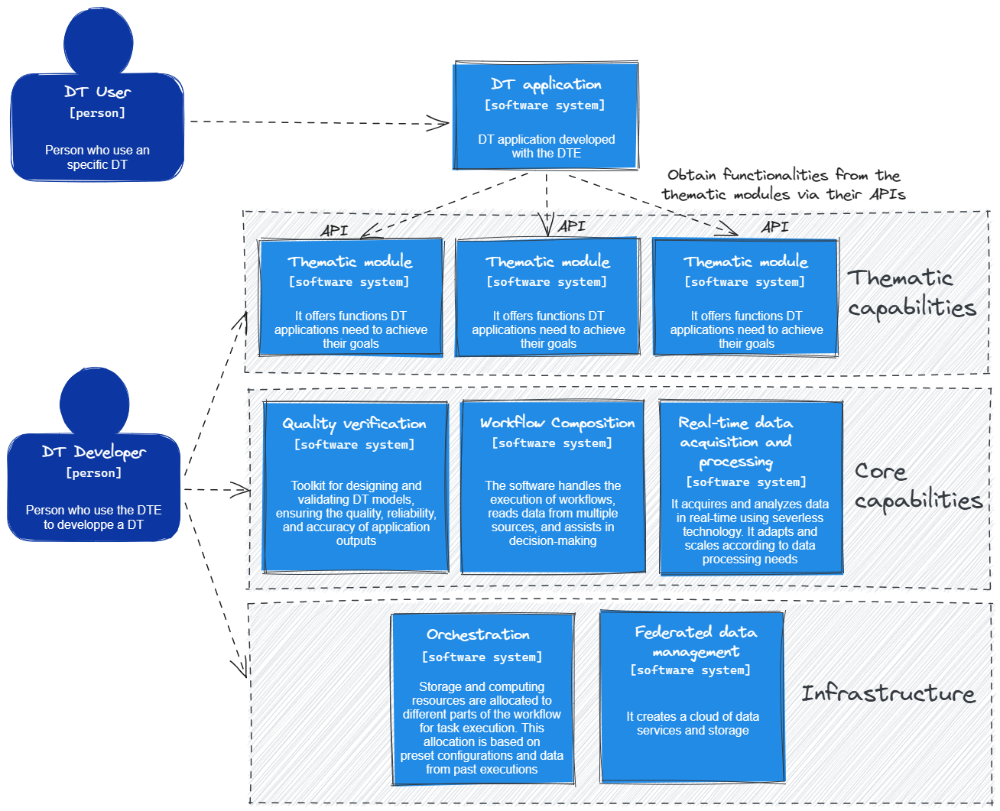

# System context diagram

The Context Diagram for the *Digital Twin Engine* (*DTE*), presented in the next figure, is composed of four main blocks:

1. *Digital Twin* (*DT*) Applications: This block represents the software applications which developers use to create, manage, and configure the DTs, and which *DT* Users use to execute the DTs for their research purposes.
2. *DT* Thematic Modules: The Thematic Modules form the second block, providing specific functionalities that *DT* Applications use to execute their processes and achieve their objectives. These modules cater to specialised requirements, and they can vary based on different application areas or themes. Developers have access to these modules to customise the *DTs* according to specific needs.
3. *DT* Core Capabilities: This block encompasses essential functionalities necessary for maintaining the integrity and efficiency of the *DTE*. Core capabilities include quality control and verification functions, workflow generation capabilities, and data acquisition and processing using Machine Learning. Developers can interact with these core functionalities to fine-tune the operation of *DT* Applications, ensuring that the applications perform as intended.
4. *DT* Infrastructure: The final block represents the underlying data infrastructure and server orchestration capabilities. This includes storage, processing, and management of data related to *DTs*, as well as the orchestration of servers to ensure efficient execution of all operations in the *DTE*.

[System context diagram (click to edit)](https://excalidraw.com/#json=-uH-rD9ed9R2wXAoA8JXT,NCVsjbpBYg1yvT4Bcflpgw)

Together, these four blocks constitute the overall System Context of the *DTE*, demonstrating how different elements of the system interact with each other and with users, both developers and users.
