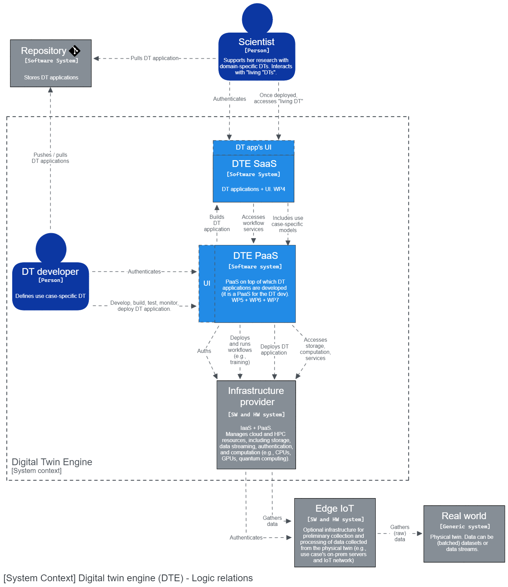
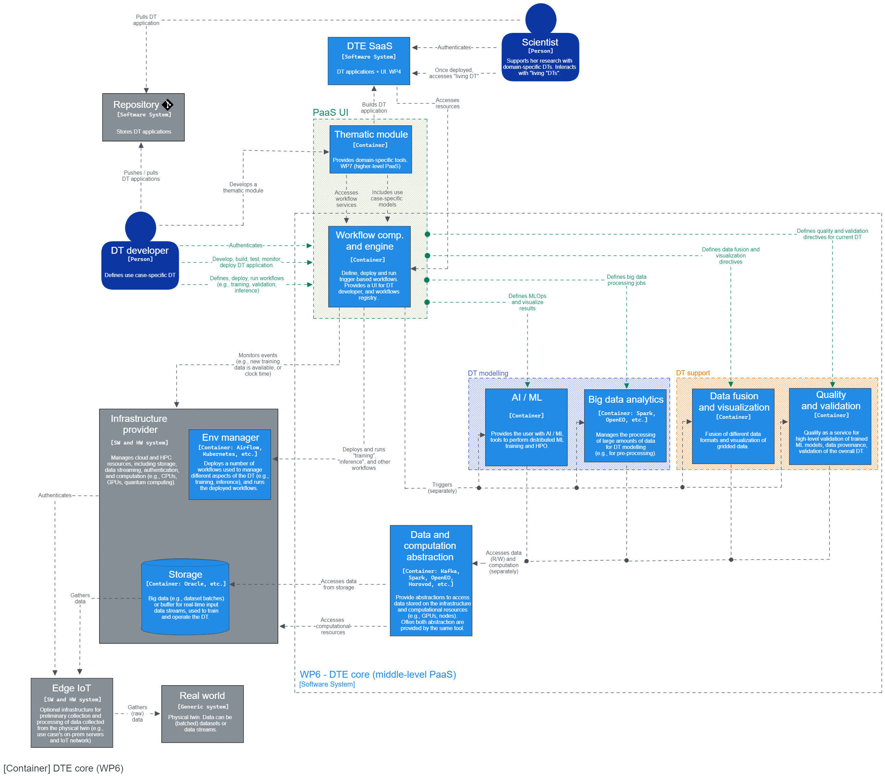
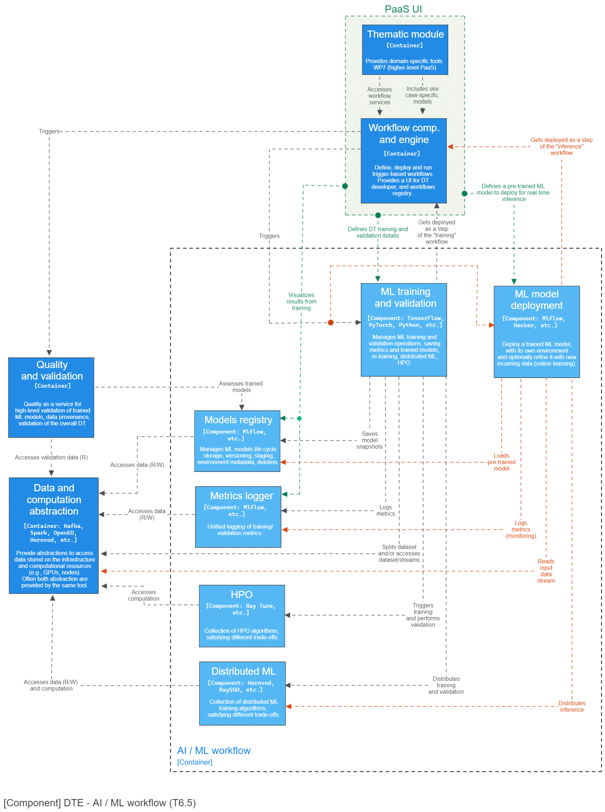

# T6.5 architecture - Conceptual design

This document provides an overview of the conceptual design for T6.5 architecture, from the digital twin engine (DTE)
system context to T6.5 components, following a top-down approach. The conceptual design has been organized according to
the prescriptions of the [C4 model](https://c4model.com/).

## System context

The system context defines the boundaries of the DTE system, and its interfaces with the surrounding environment.

We identify two main classes of users: DT developers (e.g., WP4) and DT utilizers, namely the scientists using existing
DT applications for their research.
DT developers interact with interTwin PaaS, developing DT applications, and occasionally thematic modules. These modules
provide support for new sciences in the DTE, introducing domain-specific tools and best practices, translated into
workflows by the underlying workflow composition tool. DT developers respond to researchers needs by creating new
DT applications, which are then accessed by scientists as SaaS. An utilizer can choose an "out of the box" DT
application and connect it to its use case (physical twin), or she can optionally re-train it when this is needed.
Interactions between scientists and DT application are mediated by a further UI, provided by the specific DT application.

The infrastructure provider, which is part of the DTE, provides computational resources, storage, and the connection
with the physical twin, living in the real world. Sometimes, this connection is mediated by an intermediate IoT
infrastructure (e.g., satellite, particles detector sensors), which may be needed to filter, pre-process or buffer
real-time data collected from the physical twin, and it is usually located close to the use case (e.g., on-prem servers).

## Containers in the DTE

The DT developer interacts with the DTE PaaS through some UI, which is strongly related to the DTE-core orchestrator,
the *advanced workflow composition*. This module allows the DT developer to define, deploy, and run  data-processing
workflows which constitute a DT application. Therefore, the workflow composition is strongly related with its
counterparts living in the infrastructure (e.g., K8s).

A workflow is a directed acyclic graph (DAG) of data processing operations, which can be implemented either through
DTE's built-in modules, or via user-defined modules. In fact, the DTE already provides functionalities common to
many DT scenarios, like ML training, data streaming, quality assessment, visualization, big data processing, data
fusion, and more.
The workflow composition tool is responsible for orchestrating the execution of all the modules composing a workflow,
including domain-specific tools introduced by some thematic module (e.g., Geant4, HydroMT). Most likely, the steps of
a workflow need to access computation and storage resources made available by some infrastructure provider. This is
mediated by some abstraction framework (e.g., Spark, OpenEO).  

## Components of the AI container (T6.5)

The AI subsystem in the proposed DTE is intended for data-driven DT models, and is mainly devoted to two macro
operations: training and deployment of ML models.

Training an ML model involves loading some (pre-processed) dataset from the storage, and splitting it into training
and validation splits. In the case of online learning, the training dataset is a stream. The DT developer inputs
the details of the ML model from the PaaS UI (e.g., the thematic module), including the loss function, evaluation
metrics, neural network architecture, optimizer type, etc. The user can choose among a collection of tools for both
distributed training (e.g., Horovod, RaySGD), and hyper parameter optimization (HPO). Once a model is trained, its
performances are assesses on the validation dataset (ML-level validation). ML logs (e.g., metrics) are saved on disk
and made available to the user for future inspection by means of the "metrics logger", whereas the best models are
saved in the "models registry".

Once an ML model passes domain-specific validation, performed by the "Quality and validation" DTE's module, it can be
deployed. The user chooses a pre-trained ML model from the model registry, which is going to be served as a step in the
inference workflow. There may be multiple versions available for the same ML model, and the user can choose which
version to deploy as the "living" DT. Once the full DT is deployed as a workflow, it can process real-time streams of
data from the real world, and the experimenter can interact with it (e.g., performing experiments).

