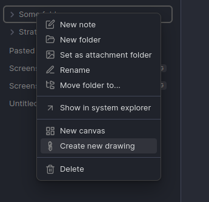
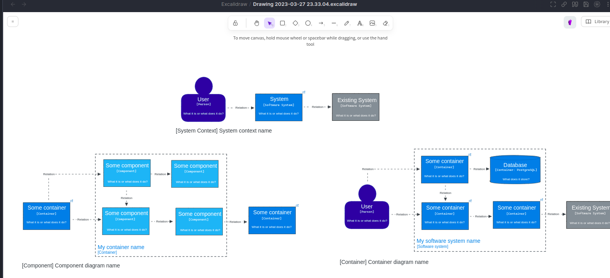
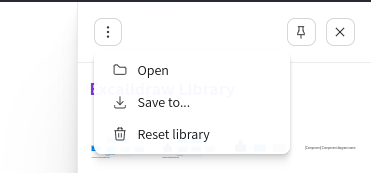
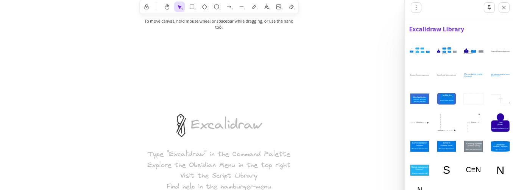
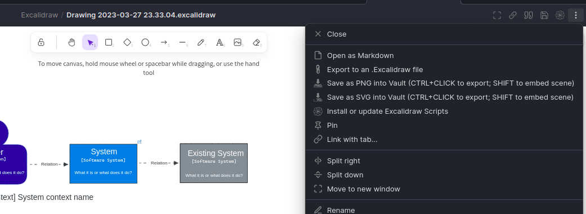

# Architecture diagrams

## Instructions for Excalidraw

Excalidraw is an open-source tool which can be used for a large variety of sketches.

To open an existing diagram (with `.excalidraw` extension), or to create a new one, you have two options:

1. Use the Excalidraw [from the browser](https://excalidraw.com/). To open an existing file: from top-left "sandwich icon"
select "Open", and browse the desired `.excalidraw` file.
2. Install [Obsidian](https://obsidian.md/) and its [Excalidraw extension](https://github.com/zsviczian/obsidian-excalidraw-plugin).
To install the desired extension, from Obsidian, use the bottom-left gear ("Setting" page), select "Community plugins"
from the left menu bar, activate them if needed. Now, by clicking on the "Browse" button, you can search and install
"Excalidraw" extension. To create a new drawing, right-click on a folder in your Obsidian vault, in which you want to
store your drawing, and select "Create new drawing". Like this: 

### C4 model library

To help you save time, we already created an Excalidraw library for the C4 model, which you can import in Excalidraw.
This library already provides the layout for the components of the C4 model. You just have to change their text content.

To import the library:

1. First, [download it from here](Excalidraw/c4-model-architecture-design.excalidrawlib).
2. Import it in Excalidraw. The procedure is the same for both the web version or the Obsidian plugin. Top-left button
"Library", select the three dots icons, and click on "Open". Select the library (`.excalidrawlib` file) from where you
downloaded it (e.g., "Downloads" folder). 
3. Scroll down in Excalidraw's library and look for the imported C4 template diagrams. 
4. Click on the items in the library to import them in your sketch.

### Save a sketch

If you work with Excalidraw as a plugin for Obsidian, sketches are automatically saved as
Markdown files. However, you can export them as:

- PNG, SVG: right-click on the sketch and select "Copy to clipboard as PNG" (or SVG)
- `.excalidraw` format: click on the top-right three dots icon, and select "Export to an .Excalidraw file". 

When using Excalidraw from browser, saving is easier: click on the top-left sandwich icon and select "Save to...".

**IMPORTANT**: sketches must be converted to `.excalidraw` format before being uploaded to this repository.
Please do not upload sketches in Markdown format, because it is not readable outside Obsidian.

### Other resources

- [Showcasing Excalidraw in Obsidian](https://www.youtube.com/watch?v=o0exK-xFP3k)
